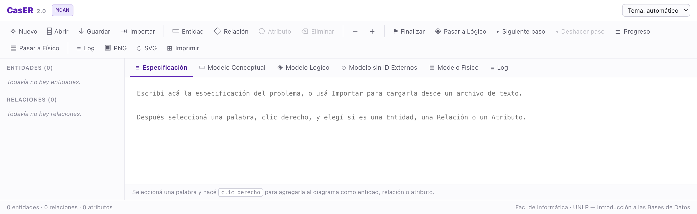
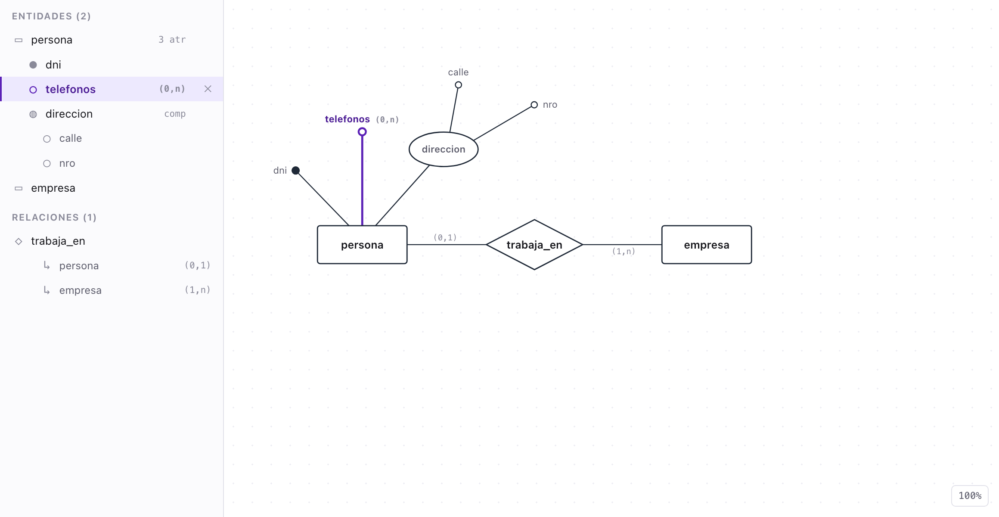
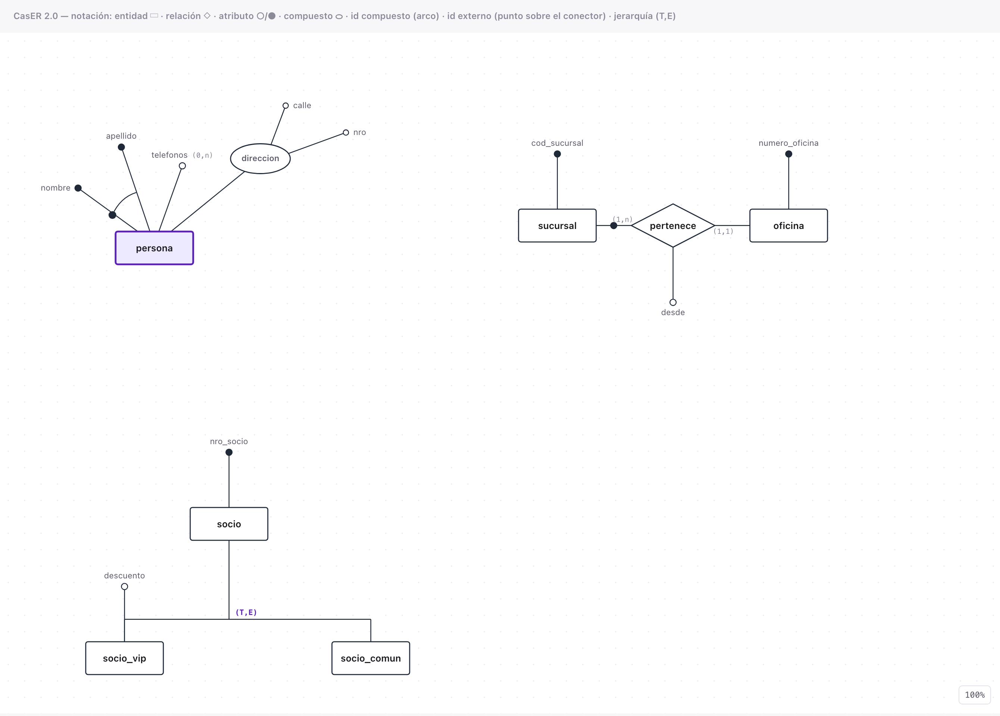
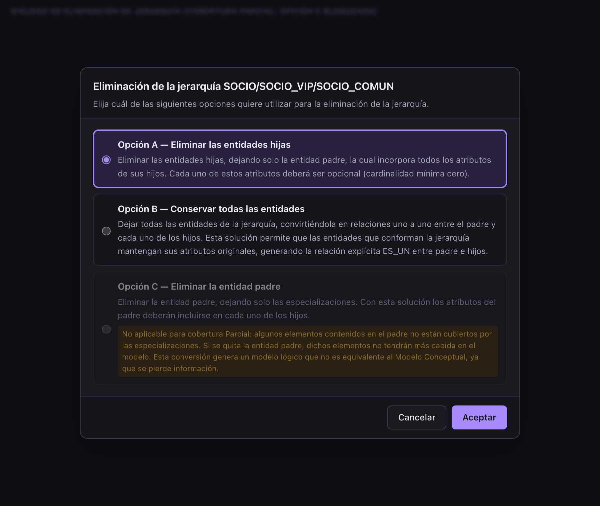
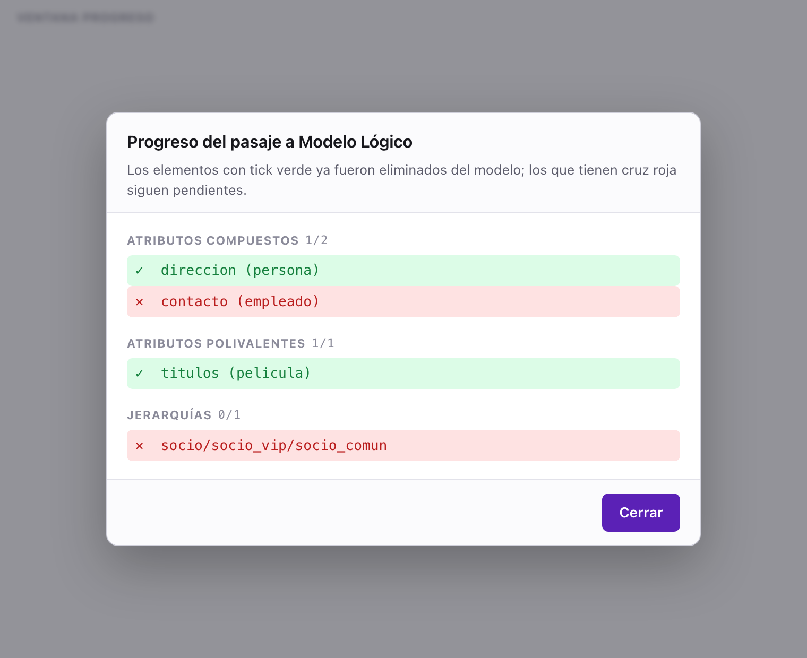

<h1 align="center">rombo</h1>

<p align="center">
  <strong>Del enunciado al esquema físico, un paso a la vez.</strong><br>
  Herramienta web de modelado de bases de datos: escribís la especificación de un
  problema, armás el diagrama entidad-relación, y la herramienta te acompaña
  decisión por decisión hasta las tablas.
</p>

<p align="center">
  
</p>

---

## Por qué existe

En la cátedra *Introducción a las Bases de Datos* de la Facultad de Informática
de la UNLP se usa **CasER**, una herramienta didáctica hecha como tesina de grado
en 2009 y 2011. Es excelente para lo que hace: no te dibuja el modelo, te obliga
a tomar cada decisión del pasaje a lógico y a físico, y te explica qué implica
cada opción.

El problema es que es una app **Eclipse RCP de 2012, sólo para Windows**. En una
Mac no arranca sin emulador.

**rombo** es una reimplementación web, local y sin instalación, de esas mismas
funciones. Las reglas de transformación no están adivinadas: el `.jar` del
programa original incluye su código fuente Java completo, así que se leyeron de
ahí, regla por regla, junto con el manual de usuario.

## Cómo se usa

```bash
npm install
npm run dev          # abre http://localhost:5173
```

Si preferís no depender del servidor de desarrollo:

```bash
npm run build        # genera dist/
open dist/index.html # se abre con doble clic, sin servidor
```

No hay backend, no hay cuentas, no sale nada a la red. Los modelos se guardan
como archivos JSON en tu máquina.

## El recorrido

Cuatro etapas, en pestañas: **Especificación → Conceptual → Lógico → Físico**.

### 1. Especificación

Escribís o importás el enunciado. Seleccionás una palabra, clic derecho, y la
agregás al diagrama como entidad, relación o atributo — con el nombre ya
cargado. Es el flujo del CasER original, y tiene una gracia: te fuerza a
justificar cada objeto del modelo señalando de dónde sale en el texto.

**Finalizar** cierra el modelo conceptual. La especificación pasa a sólo lectura;
los objetos se siguen editando.

### 2. Modelo conceptual

<p align="center">
  
</p>

Notación Chen/Batini, la que usa la cátedra:

| Elemento | Se dibuja como |
|---|---|
| Entidad | rectángulo |
| Relación | rombo |
| Atributo simple | línea terminada en círculo vacío |
| Identificador | línea terminada en círculo negro |
| Atributo compuesto | elipse, con sus atributos colgando |
| Identificador compuesto | arco que cruza las líneas de los atributos que lo forman |
| Identificador externo | círculo negro sobre el conector de la relación |
| Jerarquía | línea horizontal padre → hijos, con la cobertura `(T,E)` `(T,S)` `(P,E)` `(P,S)` |

<p align="center">
  
</p>

La cardinalidad de un atributo se dibuja sólo cuando es `(0,1)` o `(0,n)`, igual
que en el original: si es obligatorio y monovalente, no se muestra.

Todo es seleccionable con un clic y editable con doble clic, tanto en el diagrama
como en el árbol. También hay clic derecho, botón de eliminar por fila y tecla
`Supr`.

### 3. Pasaje a lógico

Tres pasos, y cada clic en **Siguiente paso** procesa un objeto y te pregunta qué
hacer con él.

**Atributos compuestos** — tres opciones: concatenar en un atributo único,
desarmar en atributos independientes, o generar una entidad nueva relacionada
1:1. La tercera queda bloqueada si el compuesto cuelga de una relación ternaria,
porque implicaría una relación 4-naria y CasER no las contempla.

**Atributos polivalentes** — se crea entidad y relación; elegís la cardinalidad
del lado nuevo.

**Jerarquías** — acá está lo más interesante. Con cobertura **Total** se ofrecen
las tres opciones: eliminar los hijos, conservar todo con relaciones `es_un`, o
eliminar el padre. Con cobertura **Parcial** la tercera no aplica, y en vez de
esconderla la herramienta te la muestra deshabilitada **con el motivo**: si se
quita el padre, las ocurrencias que no están cubiertas por ninguna
especialización se pierden, y el modelo lógico deja de ser equivalente al
conceptual.

<p align="center">
  
</p>

Mientras avanzás, la ventana **Progreso** lleva la cuenta de lo que falta, y
**Deshacer paso** revierte la última decisión.

<p align="center">
  
</p>

### 4. Pasaje a físico

Primero se resuelven los identificadores externos, y después el paso a tablas:
automático, o narrado relación por relación explicando qué regla se aplica y por
qué.

<p align="center">
  
</p>

Cada decisión que tomaste queda registrada en el **log**, que se descarga como
HTML. Es la bitácora del diseño: sirve para entregar, y sirve para releer por qué
elegiste lo que elegiste.

## Cómo está hecho

Vite + React + TypeScript. Sin dependencias más allá de eso.

```
src/
├── domain/              motor puro, sin React — se testea aislado
│   ├── types.ts         Entidad, Relacion, Atributo, Identificador, Jerarquia…
│   ├── queries.ts       consultas y detección (¿hay compuestos? ¿polivalentes?)
│   ├── edits.ts         altas, bajas y copias sobre el modelo
│   ├── pipeline.ts      máquina de estados del pasaje
│   ├── log.ts           bitácora de decisiones
│   └── transform/       compuestos · polivalentes · jerarquías · idExternos · tablas
├── persistence/         guardar y abrir en JSON
└── ui/                  canvas SVG, árbol, diálogos, vistas
```

Dos decisiones que valieron la pena:

**El dominio no importa React.** Las transformaciones son funciones puras
`(modelo, decisión) → modelo`. De ahí sale gratis que *Deshacer* sea restaurar el
estado anterior, en vez de tener que escribir la operación inversa de cada
transformación — que es lo que hace el original, con un `ControladorDeshacer` que
reconstruye cada paso a mano.

**El diagrama es SVG, no canvas.** La notación es geometría vectorial simple, el
hit-testing lo da el DOM, y exportar a SVG o PNG sale casi de arriba.

```bash
npm test             # 42 tests: motor de transformaciones + integración de la UI
```

Los tests del motor recorren los cuatro casos del manual original, que entre los
cuatro cubren cada transformación; los de integración montan la app y la manejan
como lo haría una persona.

## Formato de archivo

Se guarda en JSON legible. El formato del CasER original es serialización Java
(header `AC ED 00 05`), que no se lee todavía: la persistencia está detrás de una
interfaz `Lector` en `src/persistence/types.ts`, así que sumar ese importador es
agregar una implementación y registrarla en `LECTORES`.

## Dónde me aparté del original

Dos lugares donde el código Java se contradice consigo mismo. En ambos seguí la
regla estándar, que es la que enseña la cátedra y la que describen los propios
textos explicativos de la herramienta:

**Tabla de una relación N:M.** El original le pone como clave primaria un
subrogado `id_<relación>` y deja las claves de las entidades como columnas
comunes, lo que permitiría pares duplicados. Su propio texto dice que el
identificador es *"la combinación de atributos que constituyen las claves
primarias"*. Implementé eso.

**Matriz de cardinalidades.** El original la resuelve con ramas superpuestas y
algunas condiciones muertas — entre ellas un `||` donde iba un `&&` en
`Relacion.unoNaCeroUno`. Acá está como una matriz completa y consistente en
`src/domain/transform/tablas.ts`, con la correspondencia documentada caso por
caso.

Fuera de eso, los textos de los diálogos, los mensajes de estado y las reglas de
cada paso son los del original.

## Contribuir

Si cursás la materia y algo no anda, o querés que la herramienta haga algo que
hoy no hace, mandá el aporte: issues y pull requests están abiertos.

Hay una restricción de diseño que conviene leer antes de escribir código, porque
es la que gobierna qué entra y qué no: **el objetivo es comportarse igual que el
CasER original.** Si acá una jerarquía con cobertura Parcial ofreciera una opción
que el original no ofrece, la herramienta dejaría de servir para estudiar. Así
que todo cambio en una regla de transformación tiene que citar de dónde sale —el
manual, o la clase del fuente Java, que viene dentro del `.jar`.

Está todo explicado en **[CONTRIBUTING.md](CONTRIBUTING.md)**, incluido cómo leer
el fuente del original y una lista de por dónde empezar si querés aportar y no
sabés en qué.

La revisión y el merge los hago yo, pero la discusión es abierta: si encontrás
que el original hace algo distinto de lo que hacemos acá, eso es un bug y quiero
saberlo.

## Créditos

**CasER** es una tesina de grado de la Facultad de Informática, Universidad
Nacional de La Plata:

- **Versión 1.0 (2009)** — Soledad Antonetti y Ariel Miglio
- **Versión 1.1 (2011)** — Alejandra Durán y María Florencia Rius
- Dirigidas por **Pablo Thomas**, codirigidas por **Rodolfo Bertone**

Todo el mérito del diseño pedagógico —los tres pasos, las opciones de cada
transformación, el log de decisiones, la ventana de progreso— es de ellos. Este
repositorio es una reimplementación independiente de esas funciones para poder
usarlas en macOS y Linux, hecha para cursar la materia.

No es la herramienta oficial de la cátedra ni está afiliada a ella. Los textos de
la interfaz se reusan del programa original para mantener la fidelidad. Si sos
autor/a del CasER y querés que cambie algo de este repositorio, abrí un issue.
